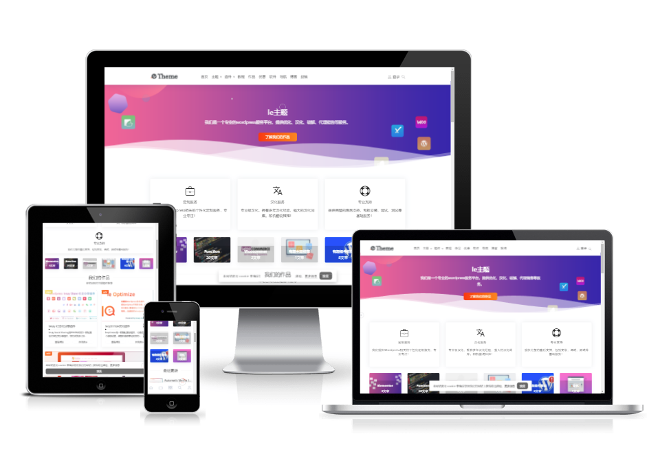

## 介绍

    <h1>WordPress Theme - Iebase</h1>
    
一款基于WordPress开发的多功能的WordPress主题，专为博客制作的一款主题，主题功能完善，设置丰富。颜值与性能并存，你想要的功能他都有。

## 安装

请到下载主题后上传安装，如果不会请参考[如何安装使用Wordpress主题](https://ietheme.com/use-wordpress-themes-step-step-guide.html)。

**提示：为了防止主题不兼容，请在安装主题前进行数据备份，防止数据字段重复覆盖等情况发生。**

### 环境要求

- WordPress `6.0+`
- PHP `7.4+`
- MySQL `5.6+`

### 主题特色

- [x] 主题体积小于0.6m，代码精，功能全，颜值高，兼容好
- [x] 无前端界面库框架，体积小，兼容好
- [x] 响应式设计，完美兼容PC端、手机端和平板等各类设备访问
- [x] 自带多种小工具，最新评论，热门文章
- [x] 支持前端用户中心，[演示](https://ietheme.com/user)
- [x] 内置资源下载文章类型, [演示](https://ietheme.com/automatic-vanilla-javascript-tabs-ui.html)
- [x] 出色的SEO功能，需加Q群（196410182）获取IE SIMPLE SEO插件
- [x] 兼容yoast seo，all in one seo
- [x] 文章点赞
- [x] 仿MacOS的代码风格及拷贝代码, [下载](https://ietheme.com/portfolio/iebase-code-block.html)
- [x] 丰富的广告位
- [x] 丰富的小工具
- [x] 更多特性请前往演示地址体验：[演示](https://ietheme.com/)

### 免费扩展

免费扩展需加Q群（196410182）获取，本主题没有集成，以插件的方式提供

- IE SIMPLE SEO -- 一个非常简单的SEO插件。您可以轻松设置和自定义每个页面的seo信息。
- Ie Users System -- WordPress的高级和简单的用户系统。
- Shortcode -- 一个包含几十个有用短码的小插件，包含功能下载，高亮显示，登录可见，评论可见等。
-	Simple App Download -- WordPress的下载管理器。[演示](https://ietheme.com/apps)
- Simple Links -- 完整的URL管理系统，导航站必备插件。[演示](https://ietheme.com/list)
- WP Kits -- 多合一优化插件，以优化您的WordPress网站。
- IeBase Portfolio -- 作品管理插件，估计大多数人用不上。[演示](https://ietheme.com/portfolio/envato-affiliate.html)

### 说明文档

- [在线文档]([https://ietheme.com](https://ietheme.com/iebase-theme/))
- 建议或BUG反馈：[立即进入](https://github.com/99839/iebase/issues)
- QQ交流群：196410182
- **若您有任何建议或BUG发现，并且您也有解决或实现的思路，欢迎直接提交PR！**

### 支持

- 大家觉得好用就进去群给群管理发红包吧，没有其他打赏方式。

### 开源协议

- [GPL V3.0](./LICENSE)
- 请遵守开源协议，保留主题底部的署名

### 演示地址

[https://ietheme.com](https://ietheme.com)
